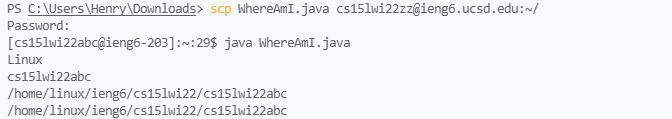

# Week 2 Lab Report

### 1. Installing VSCode

  
I downloaded Visual Studio Code from the website linked [here](https://code.visualstudio.com/) and ran the installer. This is a screenshot of the application open after installation.

### 2. Remotely Connecting

Using the terminal, I ran the command `ssh` followed by my address. After entering the password, I successfully connected to the remote server.

### 3. Trying Some Commands

On the remote server, I tried some basic commands such as `ls -a` which list all files including hidden files in the current directory. I also tried other options with `ls` and the commands `cd` and `cat`.

### 4. Moving Files with SCP

  
Running the command `scp` followed by the file and destination address copied the file to the remote server. As seen the image, I copied a java file to the server and was able to run it.

### 5. Setting SSH key
  
By using ssh, we can avoid retyping the password when logging on the server. Using the windows command `ssh-keygen` generated a public and private key. I copied the public key to the remote server and also ran the `ssh-add` command. As show in the screenshot, after the ssh keys are added, I can directly log onto the server without typing in a password.

### 6. Optimizing Remote Running
   
Using the the semicolon allowd me to run multiple commands in the same line, and putting commands in quotes after the ssh command would run the command on the remote server. The line above shows a single line that copies and runs the java file on the remote server. This made the process more efficient because after making changes to the java file, I would only need to press up arrow in terminal and run a single line to have the changes be applied and run on the remote server. The exact number of keystrokes needed to run remotely this way is 2.

