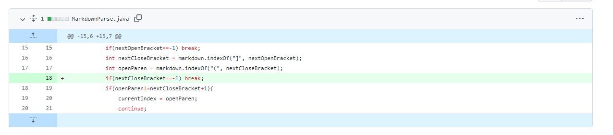
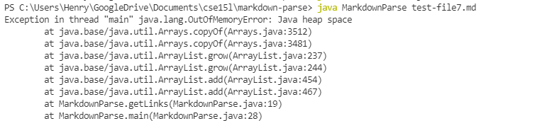
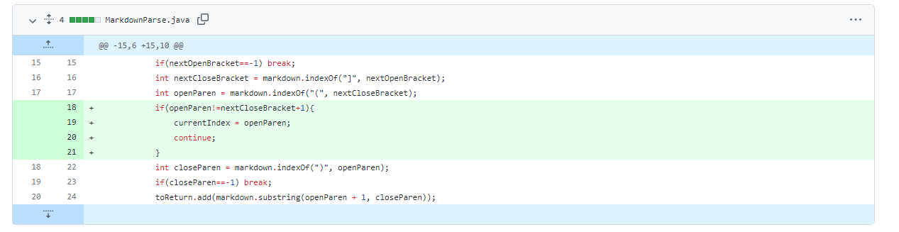
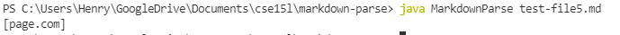
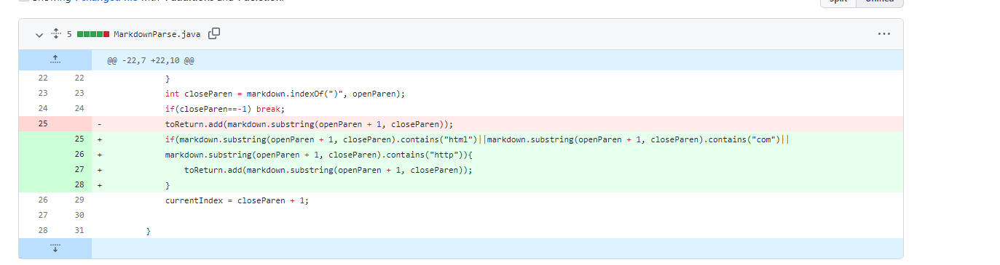

# Week 4 Lab Report

### Code Change 1

Failure inducing input was [test-file7](https://github.com/ucsd-cse15l-w22/markdown-parse/blob/2c9300a80518830d534650fc765f4731e4f1c2e9/test-file7.md)

The symptom was an infinite loop in the program.

The bug was that the program continued to search the file when there was no close bracket. This caused the symptom of an infinite loop when run with the failure inducing input which was the file with the last character being an open bracket.

### Code Change 2

Failure inducing input was [test-file5](https://github.com/ucsd-cse15l-w22/markdown-parse/blob/2c9300a80518830d534650fc765f4731e4f1c2e9/test-file5.md)

The symptom was returning a link when it was expected to return an empty list.

The bug was that the program did not check if the parenthesis followed immediately after the close bracket. This caused the symptom of returning a link when run with the failure inducing input of a file with a set of brackets followed by some text then a set of parenthesis.

### Code Change 3
\

Failure inducing input was [test-file8](https://github.com/ucsd-cse15l-w22/markdown-parse/blob/2c9300a80518830d534650fc765f4731e4f1c2e9/test-file8.md)

The symptom was returning text that was not a link when it was expected to return an empty list.

The bug was that the program did not check whether the text inside parenthesis was in the format of a link. This caused the symptom of returning the text when running the failure inducing input of a file with text inside parenthesis after brackets.
