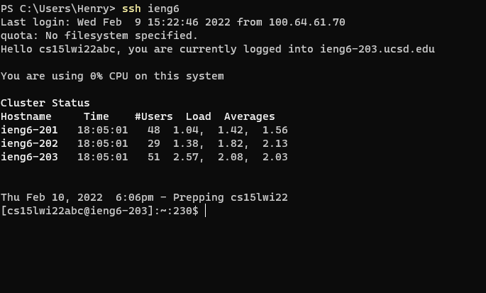

# Week 6 Lab Report

## Streamlining SSH Configuration

This is my `.ssh/config` file that allows logging into the remote server with the alias `ieng6` rather than the full URL. I created and edited the config file using VS Code.  

After editing and saving the `config` file, I was able to successfully connect through SSH using the command `ssh ieng6` which was easier to remember and type.

The config file also streamlines the `scp` proccess as the alias can be used for the destination. The above example shows successful copying of a text file from my local computer to the remote server using the `scp` command with the alias. 