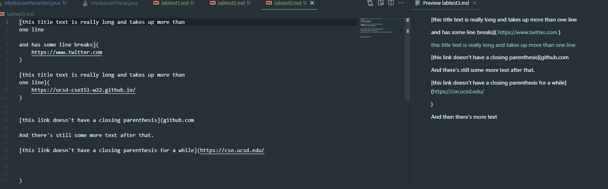

# Lab Report 4

[My Markdown Parse Repository](https://github.com/hlm01/markdown-parse)

[Reviewed repository](https://github.com/leo3friedman/markdown-parse)

### Code Snippet 1

According to the VS Code preview the expected links are `` `google.com ``, `google.com`, and `ucsd.edu`

This is the junit test used to test the snippet.

This is the output from running the test on my implementation.

This is the output from running the test on the reviewed implementation.

It would be a more involved change to make my program work for code snippet 1 and other cases related to backticks because in the current implementation, each of the `indexOf` calls take the index of the previous bracket or parenthesis as the second argument. This means all searches for these characters would have to be changed to search between for backticks as well as to check if a parenthesis or bracket is contained between backticks, which likely would require more than 10 lines of code. 

### Code Snippet 2

According to the VS Code preview, the expected links are `h.com`, `a.com(())`, and `example.com`

This is the junit test used to test code snippet 2.

This shows the output where my implementation fails the test.

This shows the output where the reviewed implementation fails the test.

It would be a more involved change to make my program work for code snippet 2 and other related cases of nested parenthesis and brackets because it would likely require a helper method that uses a counter or stack to find the matching parenthesis or bracket. In addition, there would also need to be a check for a backslash escape bracket that would ignore and search for the next bracket. These two changes are likely more than 10 lines.

### Code Snippet 3

According to the VS Code preview the expected links are `https://www.twitter.com`, `https://ucsd-cse15l-w22.github.io/`, and `https://cse.ucsd.edu/`.

This is the junit test used to test code snipped 3.

This shows the output of the test on my implementation as failing.

This shows the output where the reviewed implementation fails the test.

A small code change that will make my program work for snippet 3 is to first use the `strip` method on the substring before appending to the arraylist to remove whitespace from beginning and end. Then, add an if statement to check if the stripped substring contains a newline followed by more text by using the `split` method with `"\n"`. If the length of the resulting array is greater than 1, then update `currentIndex = openParen` and `continue`.
