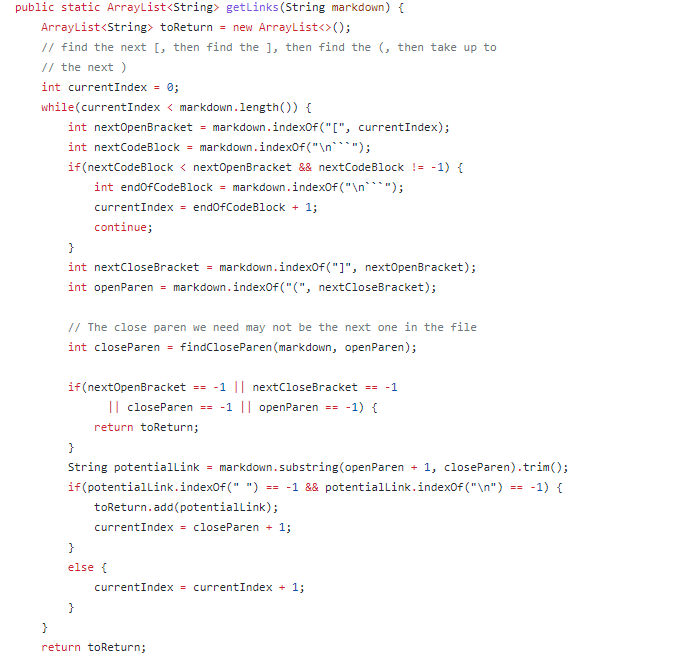

# Lab Report 5


I found the tests with different results by running `diff` on the `result.txt` of the two implementations. The provided implementation generated the file by a for loop in bash while my implementation used the overloaded `getLinks` method that took in a directory as the input.

## Test 1 (531.md)


The different results in line 962 in the output file correspond to `531.md` which is shown above. My implementation returned `[]` while the provided one returned `[/uri]`. The VSCode preview shows that neither is correct as there should be two links and the expected output should be `[/uri,/uri]`.

Another way of writing links in markdown is by using a reference which is in the format:
```
[text][ref]
[ref]: link.com
```
Both implementations do not check the file for links in this format which is the bug that causes the incorrect output. 


This is my `getLinks` method that should be fixed to find links in this format.

## Test 2 (577.md)


The different outputs in line 1062 of the result files  correspond to `577.md`. As shown above, `train.jpg` should not be returned because it is an image. My implementation correctly returns nothing while the provided implementation returns `[train.jpg]`.



The bug in the provided implementation is that the `getLinks` method does not check for the character `!` before the brackets which indicate it is an image and therefore the link should not be returned. 

